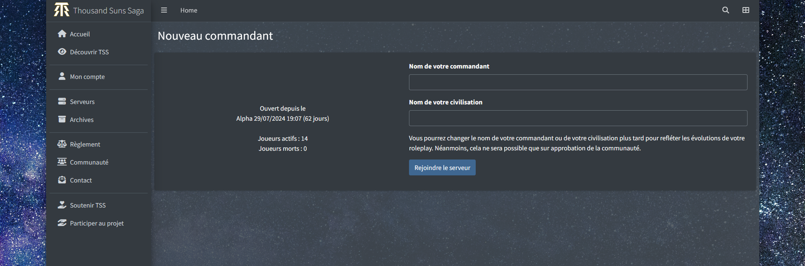

# THOUSAND SUNS SAGA

## Pre-Alpha Screenshots (2024)

***
***
### Main presentation

***
### Login

***
### Account

***
### Servers

***
### Join a server

***
### Colonies

***
### Resources

All resources (maximum planned, will be probably simplified to much less)

***
### Cartography
System view (Testing view - to be redone)

Game map with 10x10 sectors

Blue = starting sectors ; green = rich sector ; white = normal ; other = poor or particular shape

***
### Reports

